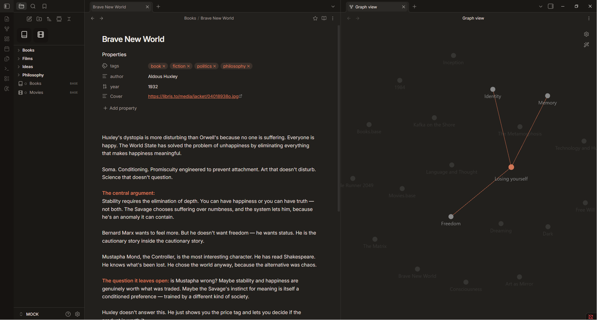

# Coding Agent

> An [Obsidian](https://obsidian.md) theme that dresses the whole app as your favorite coding agent — switchable between a Claude Code and an OpenAI Codex identity in Style Settings.

Coding Agent reskins the entire chrome (titlebar, tabs, sidebar, file tree, status bar, scrollbars) so the app reads as the chosen agent, not just the note body. Every accent-derived token recomputes from a single `--cc-accent`, so swapping looks repaints everything at once.

---

## Looks

Switch in **Settings → Style Settings → coding agent → Look**:

- **Claude Code** (default) — warm near-black surface with the Anthropic coral accent.
- **OpenAI Codex** — cool neutral black with the OpenAI teal-green accent.

Both looks adapt to Obsidian's light and dark base color schemes.

## Features

- **Whole-app reskin** — ribbon, tabs, sidebar, file tree, status bar, scrollbars, and modals all follow the active agent identity.
- **Single-accent engine** — every accent-derived token is computed from `--cc-accent` with `oklch()`, so changing the look (or the accent) repaints the entire UI.
- **File explorer as "Recents"** — airy rounded rows with a hollow status dot per file that fills with the accent on the active note.
- **Color-coded heading ladder** — `h1`–`h6` each get their own hue for at-a-glance document structure.
- **Style Settings controls** — background depth, corner radius, base font size, a monospace-everything toggle, and an optional `✳` prompt glyph before H1.
- **Refined details** — pill-shaped tags, card-style plugin lists, custom scrollbars, and subtle motion throughout.

## Style Settings

This theme exposes its controls through the [Style Settings](https://github.com/mgmeyers/obsidian-style-settings) community plugin:

| Setting | What it does |
| --- | --- |
| Look | Claude Code or OpenAI Codex identity |
| Background depth | How dark the main surface sits |
| Corner radius | Softness of panels, chips, and buttons |
| Font size | Base text size across notes |
| Monospace everything | Use the mono font across the whole UI |
| ✳ glyph before H1 | Prefix top-level headings with the accent prompt glyph |

Install Style Settings for the full experience; without it the theme falls back to its Claude Code defaults.

## Installation

### Manual

1. Download `theme.css` and `manifest.json` from this repository.
2. Copy them into your vault at `.obsidian/themes/Coding Agent/`.
3. In Obsidian, go to **Settings → Appearance → Themes** and select **Coding Agent**.

## Compatibility

- Requires Obsidian **1.0.0** or newer.
- The Source Code Pro font is loaded from Google Fonts; if you work offline, install the font locally for the full effect.

## License

[MIT](LICENSE) © 2026 Šimon Zelenka
